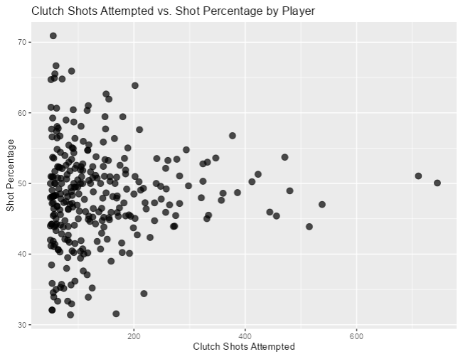
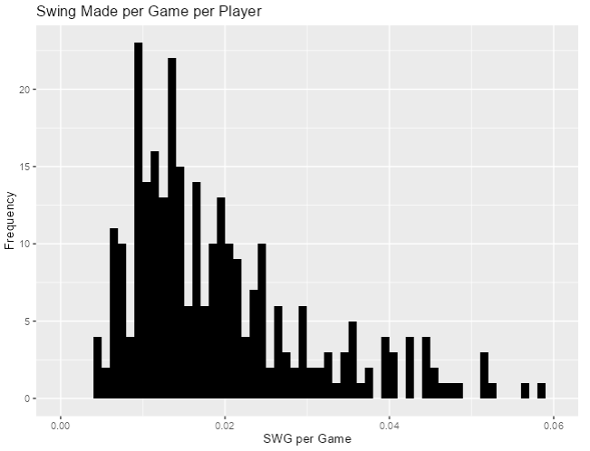
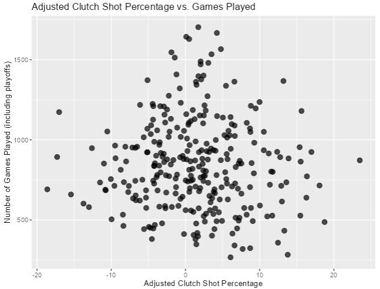

# NBA Clutch Predictor
## INFO 201 "Foundational Skills for Data Science"

Authors: Altti Koskinen

For the Final Project -- Data Wrangling, add the following to this code repository:

* An R script file containing the code you used to create your unified dataset 
* Your unified and cleaned CSV dataset file
* Data Nutrition Label (pdf) 

**Link: Link to your Shiny App here**

Please create the necessary files for your multi-page Shiny app in this GitHub repository. Consult the Canvas assignment for more details. Be sure to publish your app on Shinyapps.io.

When you are finished, please add the text from your introductory and concluding pages below. You might want to use this GitHub repository as part of your digital portfolio, so you want this README.md to offer a brief description of the project and key takeaways.

Feel free to delete these instructions for your final README.md file and to make your GitHub repository public if you would like others to be able to see it. 

# Introduction

This project aims to analyze and understand NBA player and team clutch performance using data from:

      <ul>
        <li>Clutch free throw attempts/percent made compared to overall free throw attempt/percent made</li>
        <li>Clutch shots taken, made, and percentage</li>
      </ul>
      
Clutch moments in basketball games are high pressure and show how players deal with that pressure and use their skills. Some research questions include:

      <ul>
        <li>How do clutch situations impact free throws and field goals made?</li>
        <li>How much does a player's clutch factor play into winning games?</li>
        <li>Does clutch shot efficiency rise with more attempts?</li>
      </ul>
      
These questions are important because they can enhance people's appreciation for players' skills when they matter most and how pressure impacts performance efficiency in general.

# Conclusion / Summary Takeaways
Since the 1996-97 NBA season, 39903 clutch shots have been taken, with an average of 48% success percentage. When looking at that number compared to normal shots, it is obvious the affect of pressure has on players. Free throw percentage is also down a considerable percent. Surprisingly, harder shots are made very slightly more on average by 1.38 percent, though, the range for adjusted shot percent very high. Finally the best player based on impact is Kobe, this number is the "difference between the team's win probability if the shot is made vs. if it was missed." Players with higher number have much higher impact on a team chances of winning. From this project there were a couple important insights that I will go over here.
Insight 1:
The first notable insight found from this project was over time, the more clutch shots a player attempts, their average will trend towards 50%. The graph provided shows this trend, as players with more and more attempts converge toward 50%. Shows how varied players who don't attempt many shots are, players with less than 200 attempts fall into a large range between 30%-70%.

Insight 2:
The second insight was on the overall impact of players and how most fall into the area of 0.008-0.016. This histogram visualizes where players fall for impact on a team. This number is found looking at the swing(affect on team win probability based on a shot going in or not) makes per game. The histogram is also right skew meaning most players fall in the height of the bell curve while the farther right you look the less and less players there are.

Insight 3:
The final insight I found was how games played, which essentially translates to experience, does not end up affecting how often a player can make more and more difficult clutch shots. This scatter plot displays players games played and their adjusted clutch shot percentage, which is based on difficulty of a shot. "Clutch" players end up falling into the positives for making difficult shots regardless of games played and only slightly compacts as the number of games played increases. The distribution is still about equal for a positive or negative adjusted percentage.

Most Important Insight:
From these 3 key insights, I see the first one the most improtant as it shows that experience does have an important affect on if a player can make high pressure shots. While it ends up being closer to 50/50, the high variability in low attempts makes less experienced clutch players from being much more volitile/unpredictable.
Broader Implications:
The broader implications can be used to decide who takes cruicial game winning shots when the time comes. Beyond raw talent, the ability to thrive under pressure emerges as a defining trait of elite athletes. This trait can be improved throuh expeience but from this projects insights, many playershave more inherient "clutchness" compared to others. Coaches and team management must weigh this intangible quality alongside conventional metrics when crafting game plans and roster decisions.
